<h1 align=center>Firefighting robot</h1>

---

A firefighting robot project. Details of the environment setup and the robot will be listed below.
This work was done with [Arduino IDE](https://www.arduino.cc/en/software) with all its dependencies so it should
be launched and executed with such.

Our robot is powered by an ESP32-S2, a low-cost, low-power Wi-Fi microcontroller SoC. Despite this, 
it boasts a rich set of I/O capabilities and high performance under extreme temperatures, making it ideal for our purposes.

The robot is equipped with reliable mechanical parts, low-cost and low-power flame and line sensors, an AI-powered 
camera for fire detection, and a fully integrated firefighting system. With the help of ESP Now, the system is highly 
customizable, easy to monitor, and fully autonomous, with multiple failsafes and an array of methods to detect, inform, 
and/or extinguish fires.

To summarize, our system is a low-cost, high-performance, feature-rich alternative method for firefighting. In the future, 
it could play a pivotal role in the adaptation of smart home systems and fully autonomous industrial environments.

<h1 align=center>INTRODUCTION</h1>

Hanoi has seen a significant increase in both the number and severity of fires in recent years. From
2014 to 2023, statistics indicate that Hanoi experienced 4,459 fires, which led to 202 deaths and
271 injuries. Of these incidents, 52% occurred in residential houses or combined residential and
business establishments.
In 2023-2024 alone, Hanoi witnessed four devastating fires with significant human casualties:
- On September 12th, 2023, a fire broke out in a mini apartment building in Khuong Dinh Ward,
Thanh Xuan District, Hanoi. This building, housing 40 apartments and more than 150
residents, claimed 56 lives and completely destroyed all assets in the affected apartments.
- On October 26th, 2023, a fire at a scrap-collecting house in Tu Hiep Commune, Thanh Tri
District, Hanoi, resulted in the tragic death of a mother and her two children. The father was
hospitalized in critical condition with severe burns.
- On May 24th, 2024, a boarding house located on Trung Kinh Street, Cau Giay District, Hanoi,
measuring 100 square meters across three floors with 12 rooms, caught fire, resulting in 14
deaths.
- On June 16th, 2024, a six-story private house at 207 Dinh Cong Ha Street, Dinh Cong Ward,
Hoang Mai District, Hanoi, burned down, killing four people, including a grandmother and
her three grandchildren.
Fires were mostly caused by electrical short circuits, often occurring at night, which made early
detection and intervention challenging. As a result, fires escalated rapidly, causing significant
damage. When fires were discovered, residents often struggled to escape, leading to loss of life.
The aftermath of each fire extends beyond material damage, resulting in profound human tragedy.
Most residents in mini apartments and boarding houses are students attending Hanoi’s universities
or young families. Victims of house fires are predominantly elderly and children.

I was deeply haunted by the images on news websites and social media of parents rushing from
all over the country to hospitals, anxiously awaiting news of their children, only to collapse in
despair upon learning they had passed away—some even unrecognizable.

Faced with this grim reality, I conceived the idea of creating a robot capable of early fire detection,
cutting power sources in case of electrical short circuits, alerting nearby residents, and
extinguishing fires autonomously before human intervention is required. This robot aims to reduce
fire spread risk and provide timely warnings for effective response.

I shared this idea with my cousin, Mr. Muon Duc Minh (a PhD Candidate at LAAS–CNRS, France).
With his support and encouragement, I formed a team of three members and began working on
the project in August 2024.

<h1 align=center>OUR TEAM</h1>

| Name | Information | Role/Responsibility |
| ----- | ----- | ----- |
| MUON Duc Minh  | - PhD Candidate   - LAAS-CNRS, France    | Instructor, Consultant |
| DOAN Quang Tuan  | - Student   - Hanoi Amsterdam High school for the gifted – Vietnam | - Idea Creator, Co-Inventor   - Propose ideas, design sketches   - Select components   - Measure component parameters   - Robot fabrication and installation   - Test sensor, motor |
|NGUYEN Van Thang  | - Student   - Hanoi Amsterdam High school for the gifted – Vietnam | - Co-Inventor   - 3D mechanical design from sketches   - Robot fabrication and installation |
| TRAN Van Dao  | - Student   - Hanoi University of Science and Technology - Vietnam | - Co-Inventor   - Design circuit   - Code   - Test sensor, motor |

<h1 align=center>ROBOT FEATURES</h1>

## Building Alarm System
The robot is equipped with an alarm system capable of producing loud sounds to alert building
residents in the event of a fire.
## Automatic Main Power Shutdown
When a fire occurs, the robot activates a system to cut off the main power supply using relays,
reducing the risk of electrical short circuits or secondary explosions. This function ensures the
safety of both people and equipment, facilitating firefighting efforts.
## Fire Location Detection and Autonomous Extinguishing
Using flame and smoke sensors combined with a camera, the robot accurately identifies the fire’s
location. It then navigates optimally to the site, activates its fire suppression system, and returns
to its original position, ready for the next task. This ensures continuous and efficient operation.

<h1 align=center>FIRE-FIGHTING SYSTEM DESIGN AND ASSEMBLY</h1>

## Drawings

### Mechanical 3D drawings (Solidwork)

### Electrical circuit drawings (Altium)

#### Schematic diagram of the main control circuit of the Robot

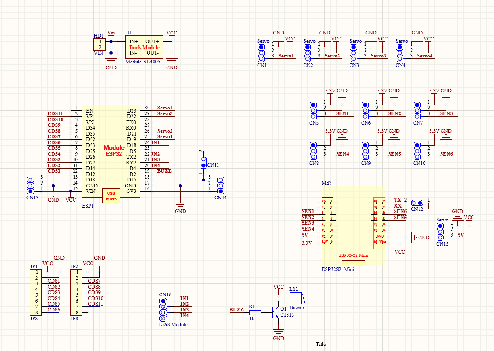

#### Circuit diagram of Robot main control circuit

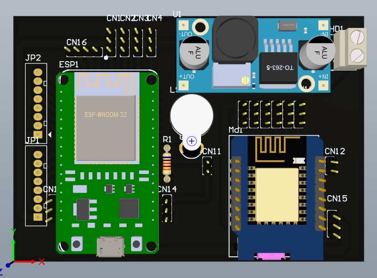

#### Schematic diagram of fire sensor circuit mounted in rooms

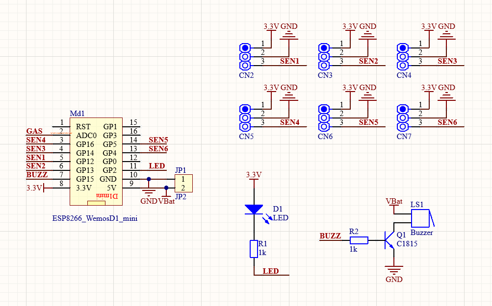

#### Circuit diagram of Fire sensor circuit

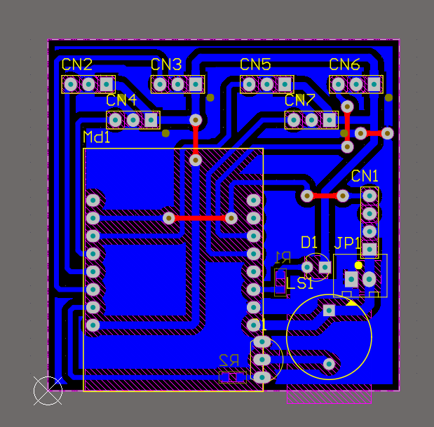
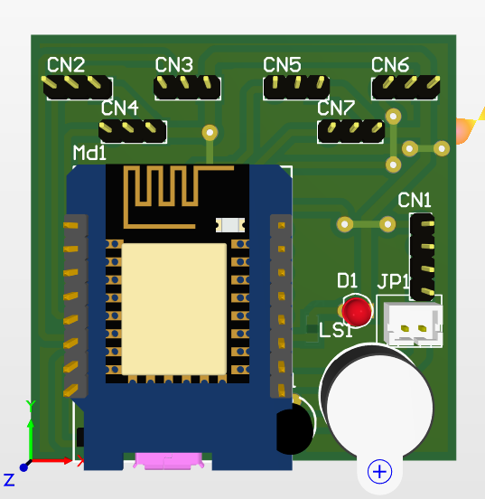

#### Line Detection Sensor Circuit Schematic Diagram

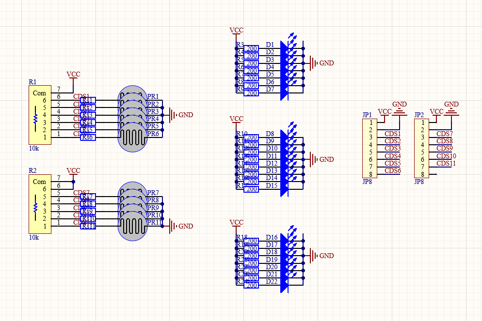

#### Circuit diagram of Line detector sensor circuit

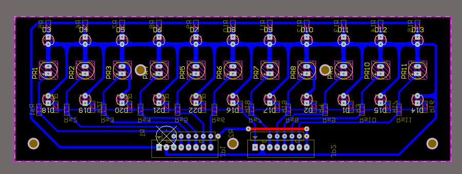

#### House simulation diagram (Map)

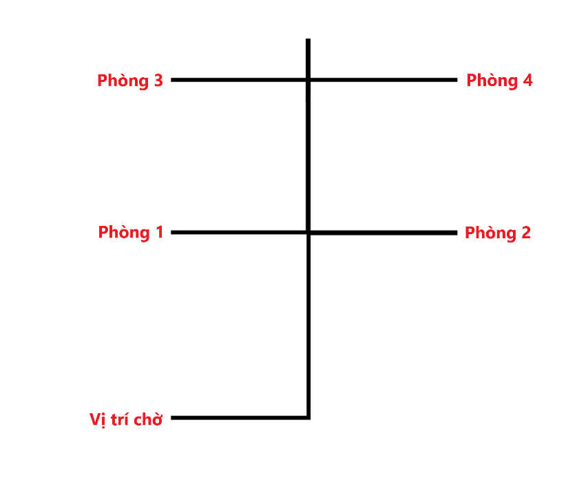

## Robot Parts Design

### Robot body design

#### Wheels

The robot uses belt wheels, similar to tank tracks, to increase friction and grip. This structure
allows stable movement across various surfaces, minimizing slippage on uneven or inclined areas.
Motors with encoders (JGB37) ensure precise speed control.

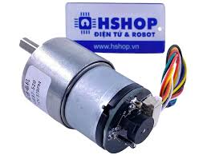

#### Chassis

Designed in 3D and CNC-cut from steel for durability and heat resistance, the chassis facilitates accurate assembly of components such as sensors, cameras, and fire suppression systems.

#### Fire Detection and Navigation

Equipped with line-following sensors, the robot tracks predefined routes to quickly and accurately reach the fire location.

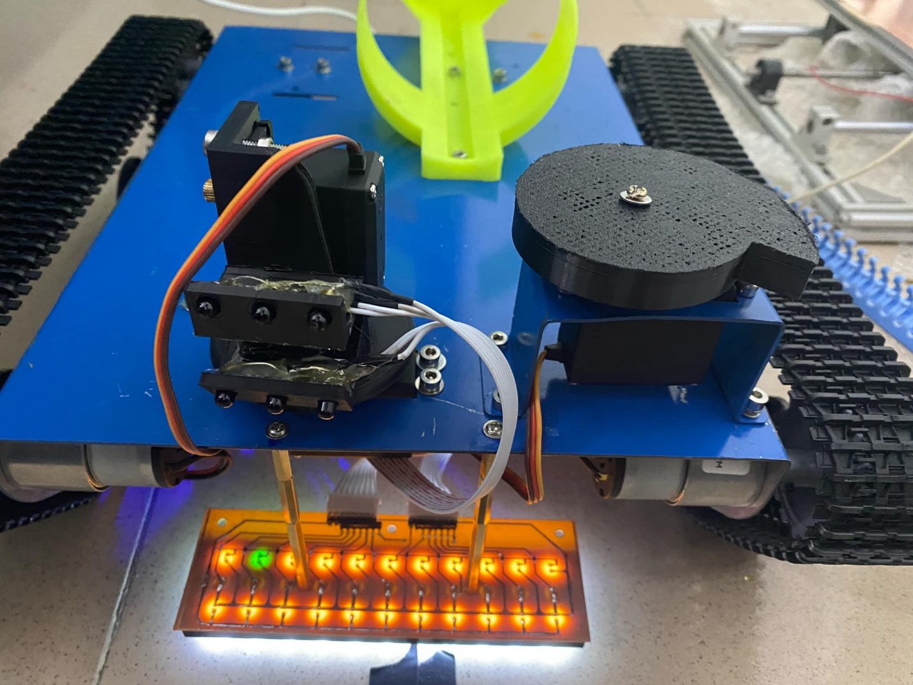

#### Fire Extinguishing Mechanism

The robot uses replaceable fire extinguishers securely mounted for stability during movement and
efficient activation when needed.

#### Flame Detection

The fire detection sensors are installed in the rooms to detect fires using infrared waves. The robot
is also equipped with a flame sensor to enhance the accuracy of fire source detection, allowing it
to adjust the nozzle to the correct direction before activating the fire extinguisher for spraying.

#### Alarm

A high-intensity alarm alerts people nearby to the fire and the robot’s location during operation.

#### Wireless Communication

Using the ESP-NOW protocol, the robot communicates wirelessly with building sensors, ensuring
fast and stable data transmission. This enables precise updates on fire locations

#### Control Circuitry

The main control circuit, created using ESP32 microcontrollers, features high processing speeds
and multiple I/O pins.

#### Power Supply

Powered by nine 18650 batteries, providing a 12V output for all operations.

### Building fire alarm sensor network desgin

#### Wireless Communication:
Sensors and robots connect wirelessly via ESP-NOW, capable of transmitting over 400 meters in
open environments.

#### Flame Sensors:
Each room has flame sensors (detecting light emitted by fire). When a fire is detected, signals are
sent to the robot to trigger warnings and extinguishing actions.

#### Alarms
Each area is equipped with separate alarms that activate when sensors detect fire, urging
evacuation.

#### Main Power Shutdown
Sensors integrated with relays cut the main power in affected areas to minimize fire spread risks
due to electrical short circuits.

Due to the tight timelines, our team has not yet completed this function. We will continue to
complete in January 2025.

## Challenges and Adjustments During Design and Assembly  
### Chassis Issues
- Initially, the team used mica to reduce costs, but it broke during operation.  
&rarr; Solution: Replaced mica with steel.
- Initial design lacked a mechanism to support fire extinguisher installation.  
&rarr; Solution: Redesigned and re-cut the steel chassis

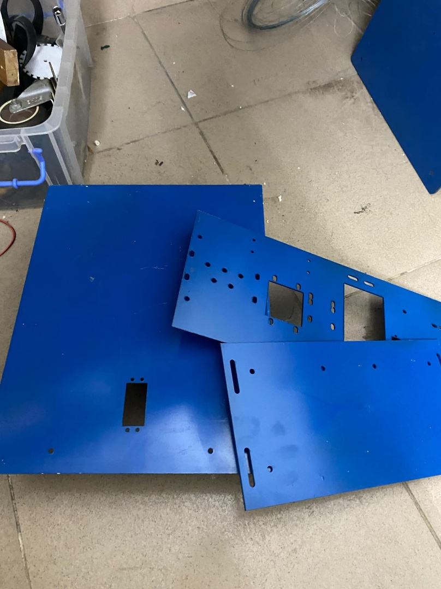

### Motor Issues
Initial design included only two motors, insufficient for the robot’s total weight (~10kg).  
&rarr; Solution: Upgraded to four motors

<h1 align=center>COMPLETION AND TRIAL RUN</h1>

After numerous adjustments, the team successfully conducted the robot’s trial run on Christmas
Eve, December 24, 2024. The robot performed all its designated functions effectively. We do hope
that in the near future, every house will have an automatic fire-fighting robot to extinguish any
fire risk from the very first seconds and there will be no more death.

[Video 1](https://youtu.be/cpQo2qXDWXk?si=D6PnczOKzeps67Xv): Robot operating with unused fire extinguisher

[Video 2](https://youtu.be/-l3LrLwg-NE?si=zJciBQ6XLEW5Xk0W): Robot operating with used fire extinguisher

<h1 align=center>PROPOSED UPGRADES</h1>

Due to the fact that the product was created by a group of students with limited experience, tight
timelines, and a limited budget, although all required functions and tasks were completed, the
final product is still at the demo stage. The development team has proposed several improvements
to make the robot smarter, more flexible, and user-friendly, as well as to enhance its firefighting
efficiency on various terrains, with the aim of making it more suitable for real-world applications.

| Feature  | Proposed Improvement |
| ----- | ----- |
| Fire Signal Detection | Integrate with building’s fire alarm system to expand detection range beyond robot-installed sensors |
| Operational Range | Currently, the robot moves based on detecting guiding lines and follows them, so it can only be used within the confines of a small apartment. It requires pre-set lines leading to potential fire hazard areas with sensors placed at those locations. An improvement could be to integrate AI and related recognition and positioning tools, allowing the robot to independently determine the most suitable path to the fire origin point. |
| Robot Shape  | Redesign with legs for stair climbing and uneven terrain navigation, add robotic arms for wider coverage |
| Operation Time | Currently, the setup time for each operation of the fire extinguisher is 10 seconds, which is the estimated time to spray all the extinguishing powder in the fire extinguisher. After this time, the system will stop, and robot will return to the starting position. This may result in situations where the robot has not yet extinguished the fire, but the extinguisher runs out, causing the robot to stop functioning. Alternatively, it may receive a signal to continue but move to the fire location and operate an extinguisher that has run out of materials, leading to an incomplete fire extinguishing effort. Therefore, the team proposes the following improvements:  1. The robot can carry multiple extinguishers at once, and the operation of these extinguishers will proceed sequentially until the fire signal is no longer detected or all extinguishers are depleted, depending on which condition occurs first.  2. The robot can return to the extinguisher storage, automatically remove the empty extinguisher, install a new one, and continue spraying to extinguish the fire as long as the fire signal persists. |
| User Alerts | Add SMS notifications for fire alerts. |
| Main power shutdown |  Add sensors integrated with relays to cut the main power in affected areas to minimize fire spread risks due to electrical short circuits. |
